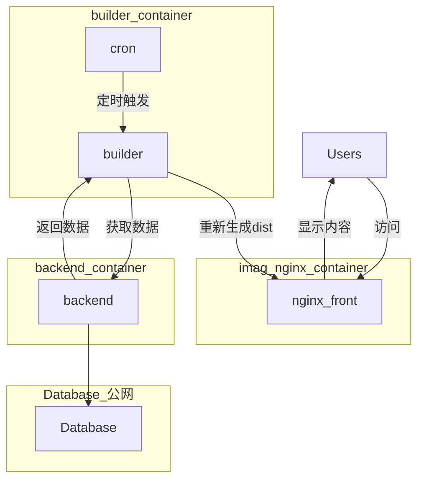

# 实验室外网主页

> 原 https://v2.imag-njust.net/
> 这块项目均不涉及到数据的修改增加删除，仅仅只是查询

## 修改后的架构

## 前端

### 修改前

前端采用了全静态的方式

每次build的时候从后端获取最新数据

根据最新数据生成dist页面然后push到github,采用GitHub pages进行部署

### 修改后

使用nginx反向代理dist

使用builder容器定时进行build操作(暂定每天凌晨4点)

后端容器化, 使用.env方便替换数据库

可使用docker-compose一键部署

## Todo

- [ ] 灰度发布 --- 每次重新build的时候dist会被删除然后重新生成，这段时间网页会404

## 问题

1. index -> 二级页面 -> 刷新 -> 出错 **原因:** 原本的url存在端口比如3000,刷新后会有一个重定向重定向到80导致错误
2. build时间很长
3. 后端没有用WSGI不符合生产规范(但是感觉够用)